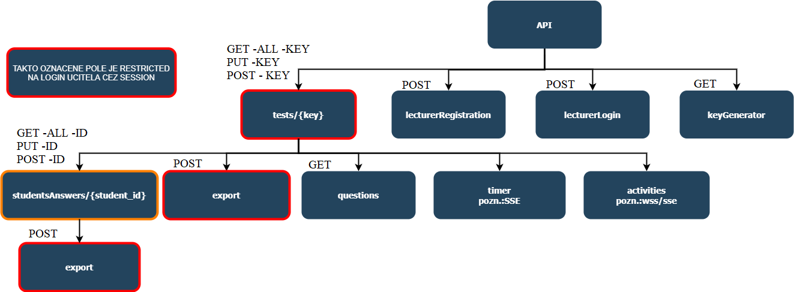

# The best Webtech2 final exam api.
HTTP Status Codes: [https://restfulapi.net/http-status-codes/](https://restfulapi.net/http-status-codes/)

Priecinok *bwte2-api* treba mat na jednej urovni s *bwte2-backend*.  
Vytvorte si novy priecinok *bwte2* do ktoreho si date aj api aj backend.
   /bwte2  
|-- bwte2-api  
|-- bwte2-backend   

!!!!POZOR NA LOMITKA!!!!!!

prilozeny obrazok nizsie vizualizuje strukturu a urovne

**REQUESTY:**

1.
`/bwte2-api/key-generator`

GET - vrati generovany unikatny kluc noveho testu

   

2.
`/bwte2-api/student-creator`

POST - prida studenta do databazy ak neexistuje
  
 

3.
`/bwte2-api/lecturer-logout`

POST - odhlasi ucitela
  
 

4.
`/bwte2-api/lecturer-login`

POST - prihlasi ucitela
  
 

5.
`/bwte2-api/lecturer-registration`

POST - registruje ucitela

   

6.
`/bwte2-api/tests/`

GET - ucitel ziska vypis testov prihlaseneho ucitela
  
 

7.
`/bwte2-api/tests/{kluc testu}`

GET - ucitel ziska informacie o konkretnom teste

POST - ucitel ulozi test

PUT - ucitel aktivuje/deaktivuje test
   

8.
`/bwte2-api/tests/{kluc testu}/questions`

GET - (student) ziska  otazky bez odpovedi konkretneho testu

   

9.
`/bwte2-api/tests/{kluc testu}/export`

POST - ucitel exportuje vysledky konkretneho testu (vsetkych studentov) do csv

   

10.
`/bwte2-api/tests/{kluc testu}/students/`

GET - ucitel ziska vypis vsetkych studentov ktori pisali test

   
  

11.
`/bwte2-api/tests/{kluc testu}/students/{id studenta}`

GET - ucitel ziska odpovede konkretneho studenta na konkretny test

POST - student ukonci svoj test a odosle odpovede

PUT - ucitel upravi bodove hodnotenie konkretneho studenta pri konkretnom teste
  
   
  

12.
`/bwte2-api/tests/{kluc testu}/students/{id studenta}/export`

POST - ucitel exportuje odpovede konkretneho studenta pri konkretnom teste do pdf

   

**SSE:**

1.
`/bwte2-api/tests/{kluc testu}/timer`

-priebezne vracia ostavajuci cas konkretneho testu od jeho spustenia u studenta
   

2.
`/bwte2-api/tests/{kluc testu}/activities`

-priebezne vracia stav ("v teste", "mimo test", "dokoncil test") vsetkych studentov ktori sa zapojili do testu
  
 

